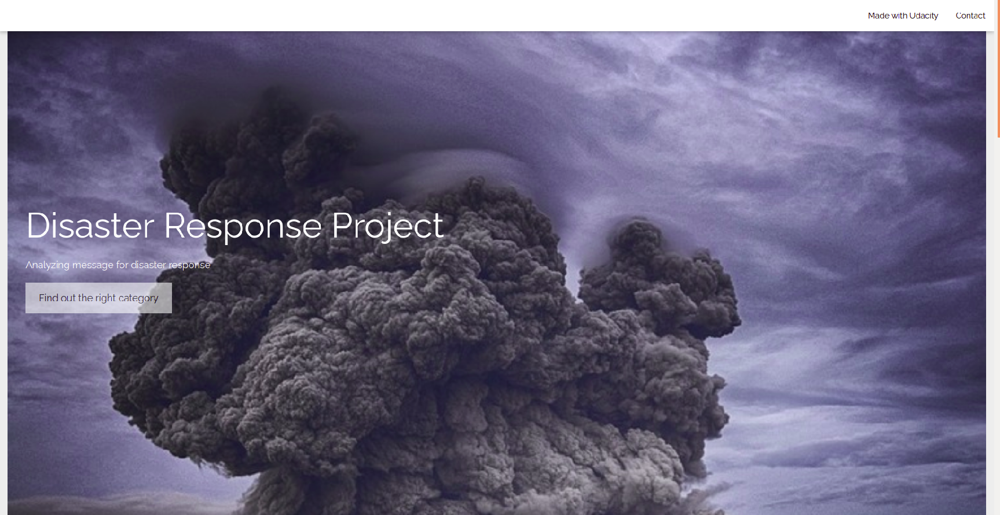
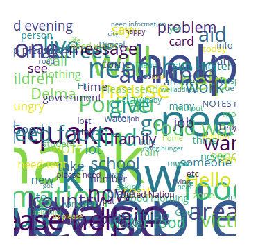
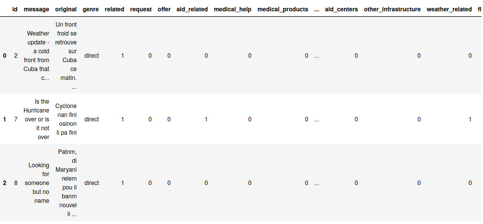
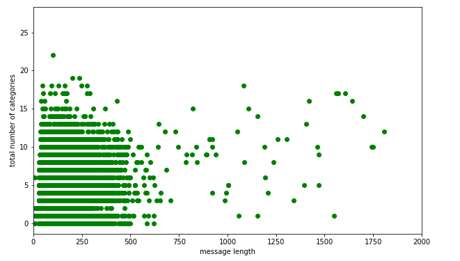
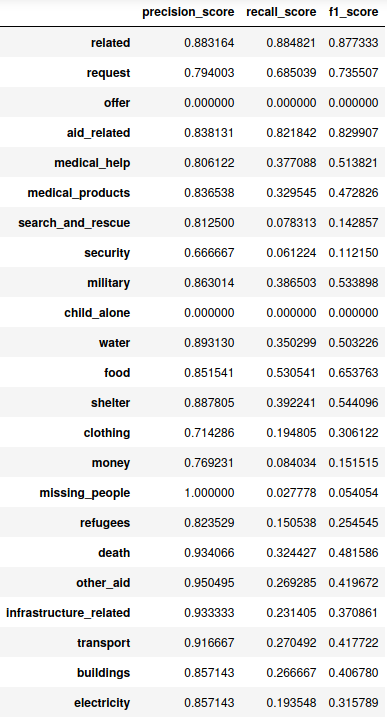
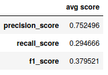
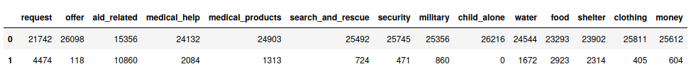

# Disaster response data analysis with python

The main aim of this project is to build a machine learning (ML) pipeline that will be able to categorize messages sent during disasters across the globe so that you can send the messages to an appropriate disaster relief agency. The project also includes a web app where an emergency worker can input a new message and get classification results in several categories. This is extremely helpful for taking necessary and prompt action.

This repository contains code written in python for data wrangling and analyses of the disaster response data. It also comes with python and html codes responsible for the back-end and front-end functioning of the web app respectively.

## Requirements

The following packages are required to run the code :
- **Python 3.7+**

- **NumPy** (`pip install numpy`)

- **pandas** (`pip install pandas`)

- **nltk** (`pip install nltk`)

- **sqlalchemy** (`pip install sqlalchemy`)

- **scikit-learn** (`pip install scikit-learn`)

- **flask** (`pip install flask`)

- **plotly** (`pip install plotly`)

- **wordcloud** (`pip install wordcloud`)

If  you are using **anaconda virtual environment**, you can install the above packages by running `conda install <package-name>`.

## List of files

- _**disaster_messages.csv**_ : This csv file is a collection of messages sent during disasters each with a unique id and a specific genre.

- _**disaster_categories.csv**_ : This file exhibits to which category/categories each of the message in  _disaster_messages.csv_ belongs to.

- _**process_data.py**_ : Python code for data cleaning and saving the data to a SQL database.

- _**DisasterResponse.db**_ : The SQL database to which the wrangled data has been stored.

- _**train_classifier.py**_ : This file contains python code to build a ML pipeline, perform grid search for hyper-parameter fine-tuning, train the model, evaluate it and finally save the model.

- _**classifier.pkl**_ : This is a pickle file which contains the trained model. One can load the model from this file for further analyses.

- _**run.py**_  :  The python file responsible for the back-end of the web app.

- _**master.html**_ : The html file that renders the homepage of the web app.

- _**go.html**_ : The html file that renders the result page of the web app where an emergency worker can enter a message and find out which category/categories the message belongs to.

- _**Procfile, requirements.txt**_ : Files needed for the deployment of the app  to the Heroku server.

## About the dataset

The dataset contains raw text messages where each of these messages belongs to a set of categories, _i.e._, a specific message can be associated with more than one categories. There are 36 different categories available.

Each category might have non binary classes , _e.g._, classes for the category 'related' are :

Therefore, this is essentially a **multiclass multilabel classification** problem. In this analysis, we have considered the column 'message' as our feature data and all the 36 categories as our target variables.

The length of a message seems to be related to the number of categories it belongs to. The below plot shows the length of a raw message as a function of corresponding total number of categories.

As we see from the plot, long messages genearlly tend to belong to a higher number of categories. In other words, long messages might carry more information. After the raw text cleaning, each message boils down to a set of tokens. A message carrying more information (_i.e._ more relevant words) is likely to end up with more number of tokens. Hence, we consider length of a token corresponding to a raw input message as an additional feature of our dataset.

To process the raw text data, we have followed the below steps :

- Normalization *i.e.* conversion to lower case and punctuation removal
- Tokenization
- Stop words removal
- Lemmatization

## Analysis of the dataset

We train our model using two features :

- list of tokens and
- number of tokens,

each associated with an input message. In order to convert the former feature to a numerical one, we use TfidfVectorizer class of scikit-learn library. Since both these features are associated with the raw text, we cannot build a pipeline with these features as consecutive steps. Instead, we use featureunion to run them parallelly inside a pipeline and then feed the combined output to our classifier. To find better set of hyper-parameters for the classifier, we have also performed grid search.

Among the three algorithms that we use to train our model, namely, multinomial naive bayes, random forest classification and k nearest neighbors classification, multinomial naive bayes leads to better results and also takes less time to train the model.

We use our trained model to make predictions on the test set. Note that since it is a multiclass multilabel classification problem, there is no direct way to evaluate model's performance across all the categories. Instead, we compare model's prediction with the true value for each category separately. We choose three evaluation metrics - precision, recall and f1 scores. The following image shows these three scores for the first few categories evaluated on the test dataset :

One can now calculate average for each of these scores across all the categories -

The dataset that we are working with is highly imbalanced as can be seen from the below image:

For such a skewed dataset, precision and recall are known to work better over the standard accuracy measurements. Precision is the number of true positives divided by the total number of data instances labeled as the positive class. On the other hand, recall is the number of true positives divided by the total number of data instances predicted as belonging to the positive class. And f1 score is the harmonic mean of these two.

From the table of average score, we see that our model, on average, has a precision score around 0.75. In other words, our model predicts a particular message belonging to the true category with a high probability. Consider, for example, a disaster message asks for food and therefore should be categorized as 'food'. Since our model has a high precision value, the number of times this message will not be categorized as 'food' (_i.e._ false positive) is small and hence the model serves the purpose. Note that, in this case the false negative would correspond to the situation when the model misclassifies a message to belong to the 'food' category. But from the perspective of the applicability of this project, it is more important to have a low false positive rate (_e.g._, not being able to provide food to the needy) as compared to false negative rate (_e.g._, provide food to the people who do not need it). Therefore, precision seems to be more appropriate than recall and looking at the score table, we can say that our model does a pretty good job.

## External link

To get a basic understanding of a multiclass multilabel classification, you can look at my article on [**Medium**](https://medium.com/analytics-vidhya/classifying-the-classifications-91db4e58fd0f).
